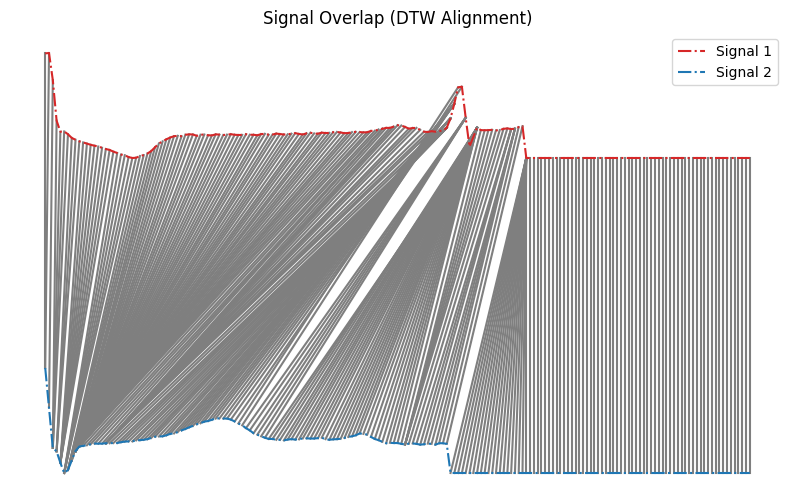
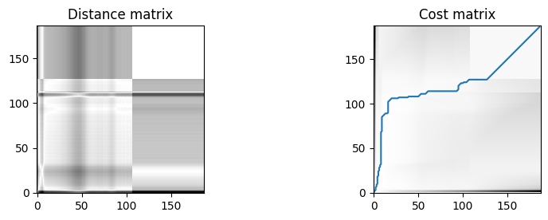
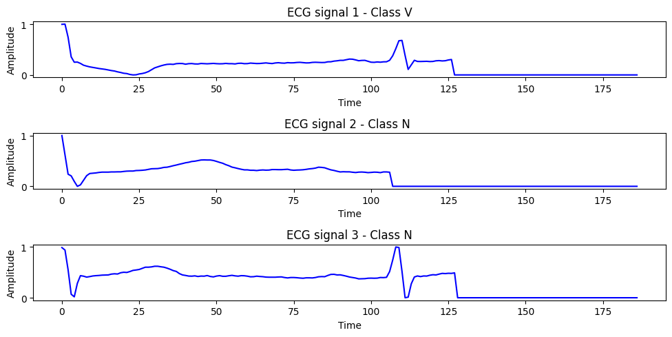

# Dynamic Time Warping Algorithm + Mini Project

Dynamic Time Warping (DTW) is an algorithm used to measure similarity between two temporal sequences, which may vary in speed or length. By allowing non-linear alignments in the time dimension, DTW finds an optimal match between two signals and computes a distance reflecting their overall similarity. This is particularly useful in applications such as speech recognition, gesture analysis, and any scenario involving time-series comparison where uniform time alignment is not guaranteed.

<div align="center">
  <table>
    <tr>
      <td></td>
      <td></td>
    </tr>
    <tr>
      <td align="center"><b>Figure 1a:</b> Distance Matrix</td>
      <td align="center"><b>Figure 1b:</b> Cost Matrix with DTW Path</td>
    </tr>
  </table>
  <p><b>Figure 1:</b> Visualization of DTW computation showing distance and cost matrices.</p>
</div>

## Algorithm

1. **Initialization**  
   - Store input signals `signal1` and `signal2`.  
   - Initialize the distance matrix and cost matrix with appropriate shapes.

2. **Compute Distance Matrix**  
   - For each pair `(i, j)`, compute the absolute difference:  
     ```
     distance_matrix[i, j] = |signal1[i] - signal2[j]|
     ```

3. **Initialize Cost Matrix**  
   - Set the starting point:  
     ```
     cost_matrix[0, 0] = distance_matrix[0, 0]
     ```
   - Fill all other entries with `inf`.

4. **Dynamic Programming**  
   - For each `(i, j)`, update the cost matrix using:  
     ```
     cost_matrix[i+1, j+1] = distance_matrix[i, j] + min(
         cost_matrix[i, j],        # match
         cost_matrix[i, j+1],      # insertion
         cost_matrix[i+1, j]       # deletion
     )
     ```
   - Store the direction of the minimum cost for backtracking.

5. **Backtrace Path**  
   - Start from the bottom-right `(N-1, M-1)` and move backward based on stored directions  
   - Construct the optimal alignment path.

6. **Compute DTW Distance**  
   - Return the DTW distance:
     - Normalized:  
       ```
       dtw_distance / len(path)
       ```
     - Unnormalized:  
       ```
       dtw_distance
       ```

## Mini Project - ECG Heartbeat Classification


This mini project demonstrates the application of the DTW algorithm in classifying ECG heartbeats. By using DTW as a distance metric we can train a classifier (based on distance metrics) to classify a signal into one of the five classes, even when there is time variability in signals.

The dataset uses the AAMI standard to group heartbeats into five major classes:

| Label | Code | Description |
|-------|------|-------------|
| 0     | N    | **Normal and Bundle Branch Block beats** — Includes normal beat (N), left bundle branch block beat (L), right bundle branch block beat (R), atrial escape beat (A), and nodal (junctional) escape beat (J). |
| 1     | S    | **Supraventricular ectopic beats** — Includes atrial premature beat (A), abnormal atrial beat (a), and nodal premature beat (J). These originate above the ventricles but outside the sinus node. |
| 2     | V    | **Ventricular ectopic beats** — Includes premature ventricular contraction (V) and ventricular escape beat (E). These originate in the ventricles and are often considered more serious. |
| 3     | F    | **Fusion beats** — Includes fusion of normal and ventricular beats (F). These occur when both a ventricular and a normal beat activate the ventricles simultaneously. |
| 4     | Q    | **Unknown beats** — Includes paced beats (/), fusion of paced and normal beats (f), and other unclassified beats. These are generally excluded from analysis. |


<div align="center">

</div>

## 📁 Dataset Description

- **Source**: [ECG Heartbeat Categorization Dataset](https://www.kaggle.com/datasets/shayanfazeli/heartbeat/data)
- **Samples**: ECG signals from various patients, each labeled with a heartbeat class.
- **Classes**: Normal, Left/Right bundle branch block, Ventricular ectopic, etc.

## 🧠 Problem Statement

Use DTW to classify an ECG heartbeat segment by comparing it with known labeled beats.

### 🛠️ Methodology

1. **Data Preprocessing**  
   - Extract ECG signals with labels.
   - Split the sets into train test and validation.

2. **KNN-DTW Classification**  
   - Train a KNN classifier using DTW as a distance metric.

3. **Evaluation**  
   - Accuracy, Precision, Recall
   - Confusion Matrix

## 📊 Results

- DTW Accuracy on test set: `XX.X%`
- Confusion Matrix:

  | Actual \ Predicted | Normal | LBBB | RBBB | PVC | ... |
  |--------------------|--------|------|------|-----|-----|
  | **Normal**         |   ✓    |      |      |     |     |
  | **LBBB**           |        |  ✓   |      |     |     |
  | ...                |        |      |      |     |     |

- Visual comparison of beat alignment and class decisions.


## 🧾 Conclusion

- DTW provides a robust way to compare heartbeat shapes independent of exact time alignment.
- Despite its simplicity, it performs competitively on noisy real-world ECG signals.

## 🔮 Future Work

- Explore dimensionality reduction (e.g., PCA) before DTW
- Combine DTW with ML classifiers like KNN or SVM
- Real-time ECG stream classification
